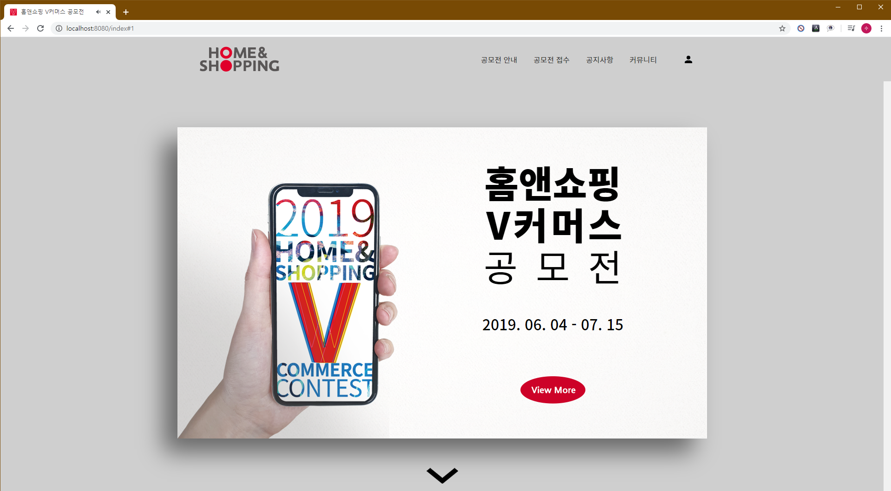
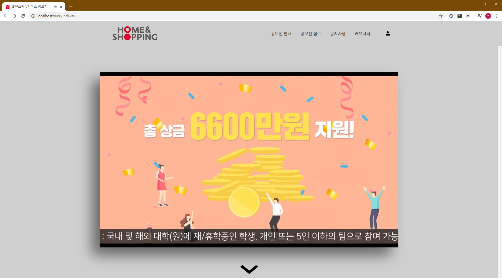
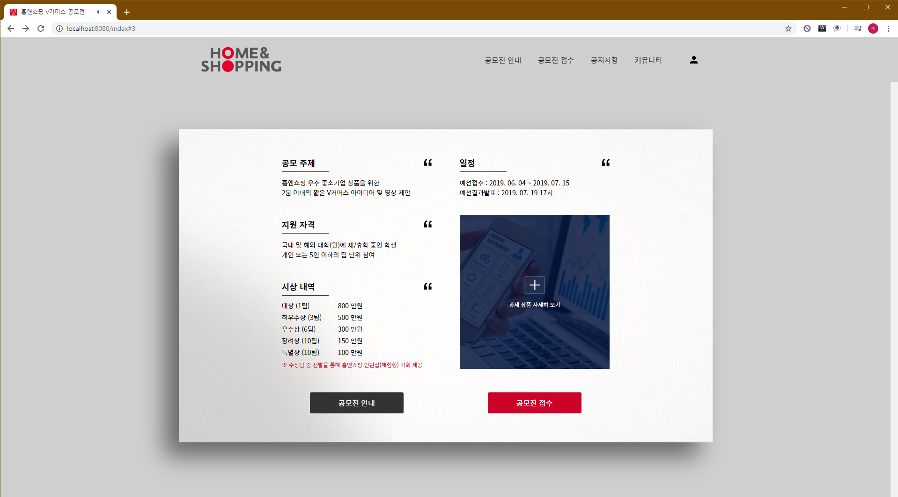
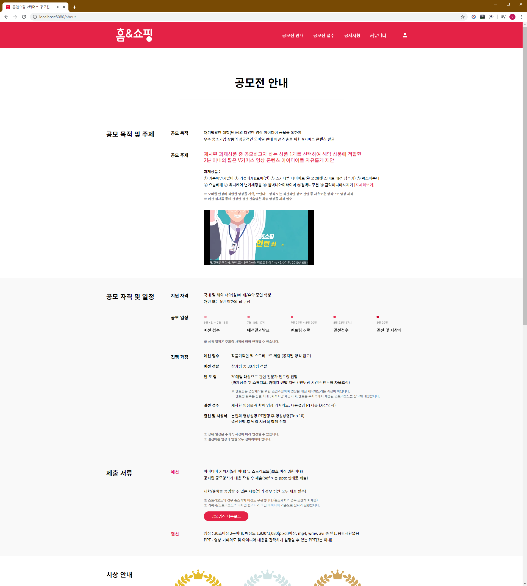
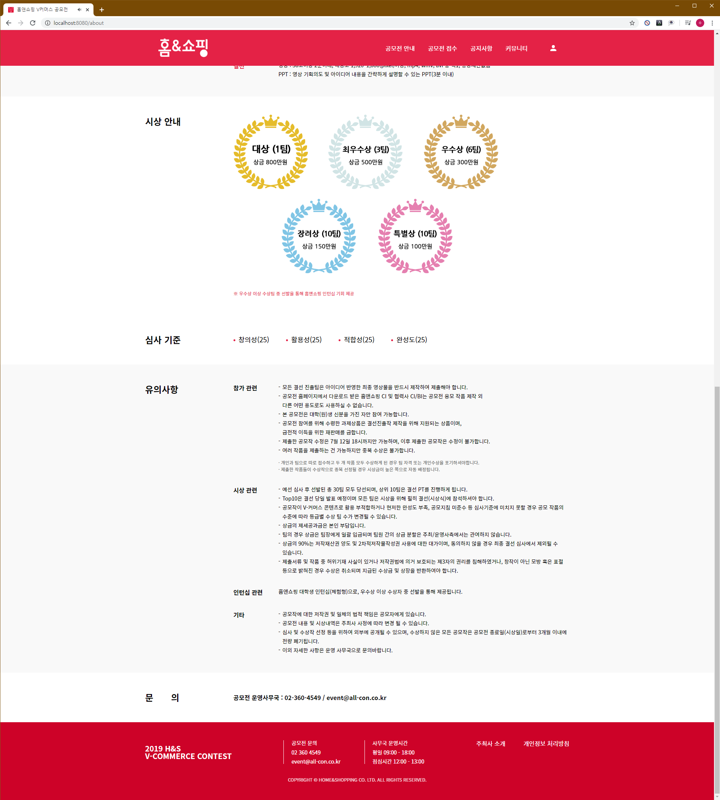
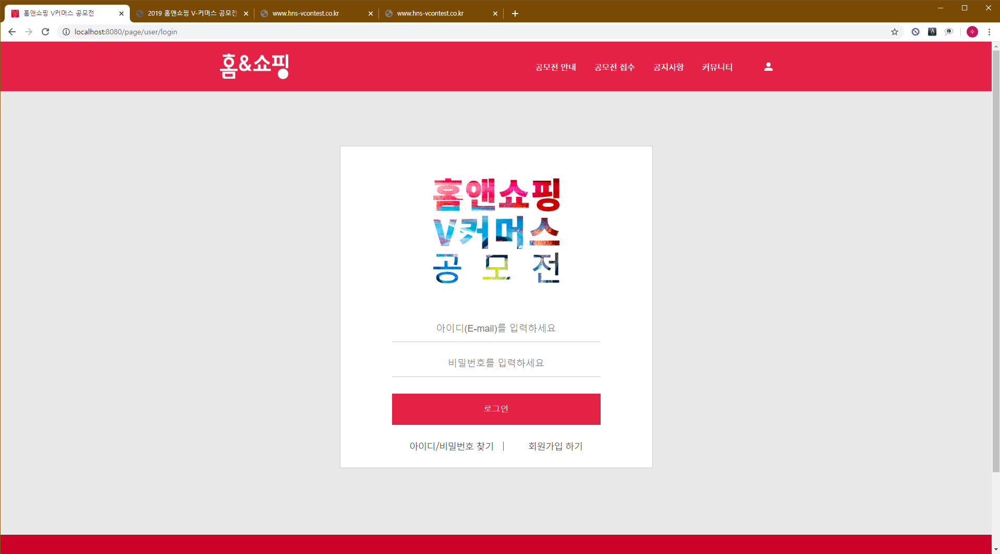
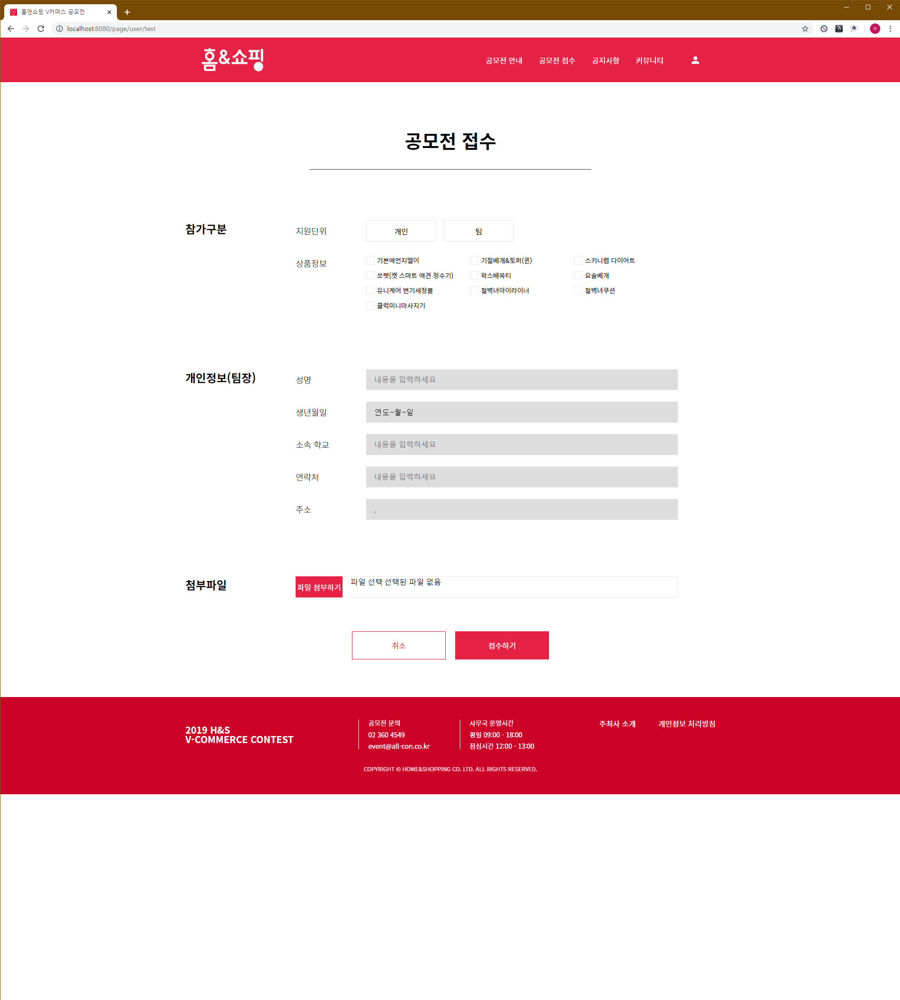
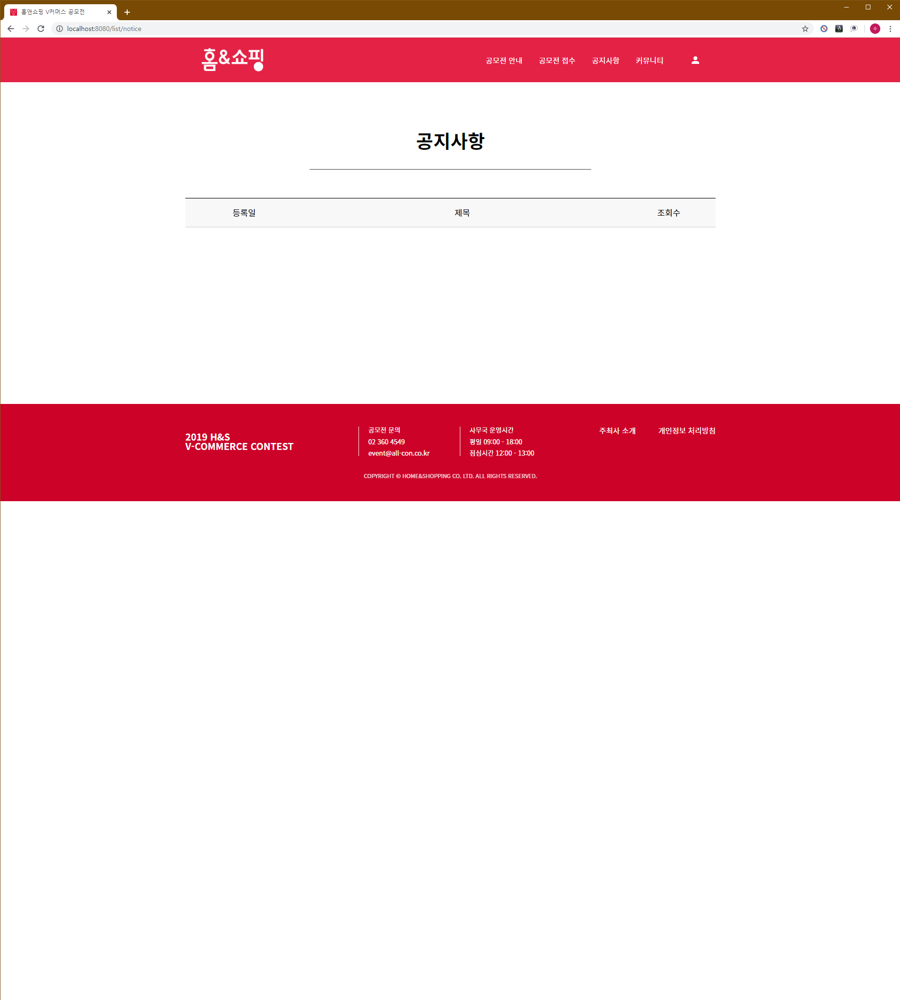
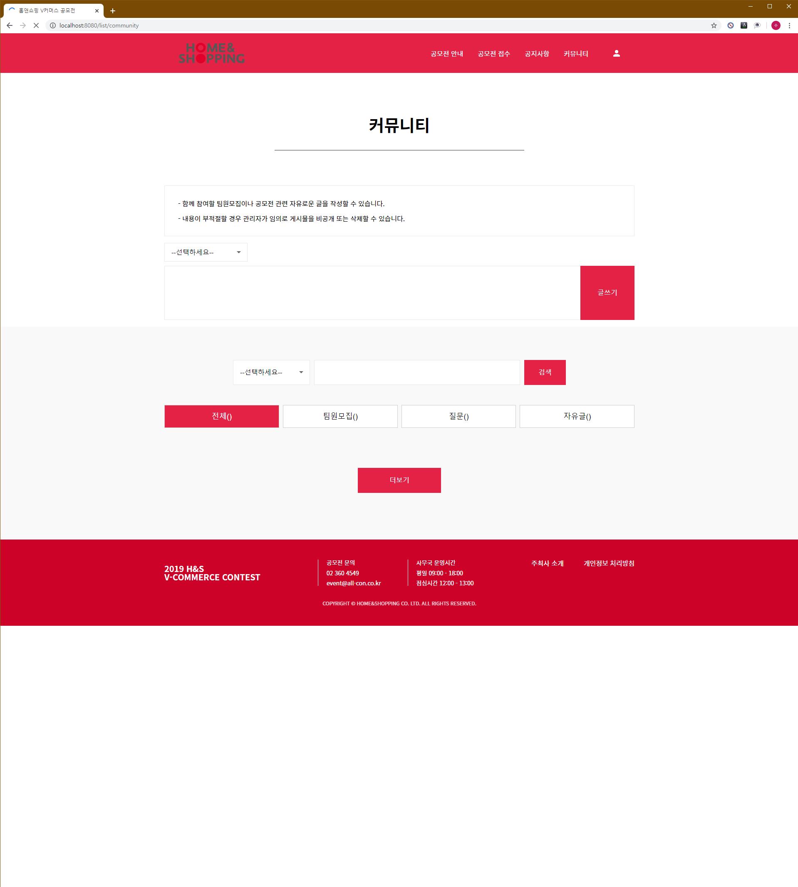

## 프로젝트 개요

해당 프로젝트는 홈앤쇼핑 공모전을 위해 제작된 사이트입니다
 
게시판을 만드는데 참여했습니다
 
 

## 작업 포인트

간단한 기능의 공지사항과 커뮤니티 기능을 작성하였습니다
 
Ajax를 이용해 화면에 정보가 빠르게 나타날 수 있도록 했습니다.

 
 

## 개발 기술

Java·Spring
 
HTML5/CSS3·Bootstrap4
 
Javascript·Ajax·JQuery
 
MySQL·Mybatis
  
  
  
  
http://www.hns-vcontest.co.kr
  
  
  
  

  

  

  

  

  

  

  

  

